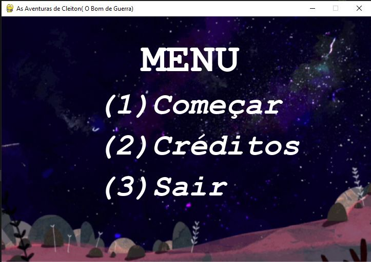

# 🎮 The Adventures of Cleiton - 2D Python Game


A 2D game developed in **Python using Pygame**, focused on gameplay logic, game states, and structured code organization.

This project was created in an academic context and received **regional recognition**, highlighting the practical application of programming concepts in game development.

---

## 🎮 Game Menu Preview



> Main menu screen showcasing navigation options such as Start, Credits, and Exit.

---

## 🧠 Project Overview

The game was designed to apply and demonstrate core concepts of **2D game development**, including:
- Game loop control
- Player interaction
- State management (menu, gameplay, credits)
- Visual rendering and event handling

The project emphasizes **clean structure and logic**, rather than complex graphics.

---

## ✨ Features

- Interactive main menu
- Keyboard-based navigation
- Game loop with update and render cycles
- Modular game states (menu, gameplay, credits)
- Simple 2D graphics and animations
- Organized asset handling

---

## 🕹️ Controls

- Keyboard input for menu navigation  
- Keyboard controls for player movement during gameplay  

*(Exact keys can be adjusted or documented in code comments.)*

---

## ⚙️ Game Engine & Architecture

- Built with **Pygame**
- Custom game loop implementation
- Event-driven input handling
- Separation of concerns between game states
- Asset management for images and resources

---

## 🛠️ Tech Stack

- **Python**
- **Pygame**
- Basic 2D graphics and animation handling

---

## 🚀 How to Run

1. Clone this repository  
2. Install the required dependencies:
```bash
pip install pygame

